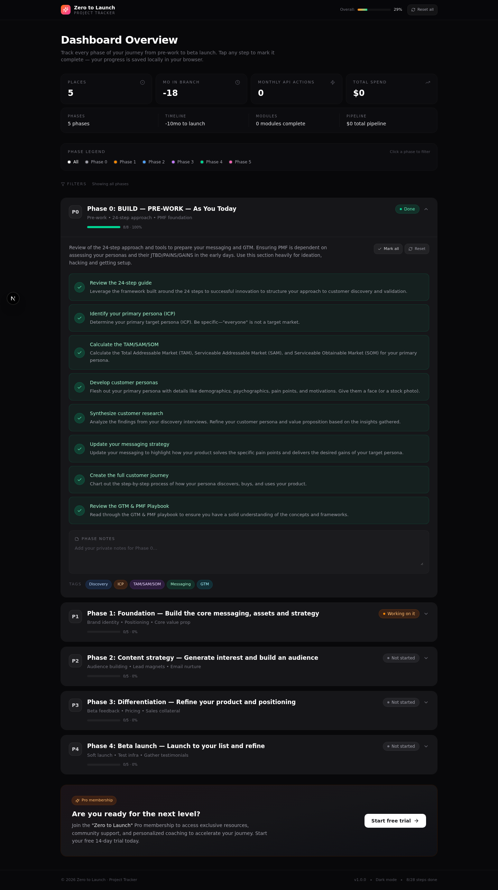

# Zero to Launch — Project Tracker

A dark-mode project management web interface for tracking the 5-phase "Zero to Launch" journey: from pre-work and PMF validation through beta launch. Built with Next.js 16, TypeScript, Tailwind CSS 4, and Lucide icons.



## What's inside

This package contains **two ways to run the tracker**:

### Option A — Pre-built Static Version (recommended, no install required)

Just open the included `static/` folder's `index.html` in your browser, or serve it with any static file server:

```bash
# Option 1: Python (already installed on macOS/Linux)
cd static
python3 -m http.server 8080
# Open http://localhost:8080 in your browser

# Option 2: Node.js
npx serve static

# Option 3: Just double-click static/index.html
# (works in Firefox; Chrome may need a static server due to file:// fetch restrictions)
```

Your progress is saved in `localStorage`, so it persists between sessions on the same browser.

### Option B — Full Source (for developers)

Requires Node.js 20+ and Bun (or npm):

```bash
cd source
bun install         # or: npm install
bun run dev         # or: npm run dev
# Open http://localhost:3000
```

To rebuild the static export from source:

```bash
cd source
bun run build       # produces ./out/ directory
```

## Features

- **5 expandable phase cards** (Phase 0 → Phase 4) with status badges
- **Two card body styles**: numbered checklist (Phase 0) and 2-column grid (Phases 1-4)
- **Click any step to mark it complete** — progress bars update in real time
- **Per-card "Mark all" and "Reset" actions** for batch updates
- **Per-phase notes textarea** — capture private notes for each phase
- **Global "Reset all" button** in the header (with confirmation)
- **Phase legend + filter chips** — click a phase to filter visible cards
- **Overall progress indicator** in the sticky header
- **localStorage persistence** — your work survives page refresh
- **Fully responsive** — 2-column metrics on mobile, 4-column on desktop
- **Dark mode** — deep `#08080a` background with charcoal cards

## The 5 Phases

| Phase | Title | Items | Status |
|-------|-------|-------|--------|
| 0 | BUILD — PRE-WORK | 8 checklist items | Overdue |
| 1 | Foundation — core messaging, assets, strategy | 5 grid items | Active |
| 2 | Content strategy — audience building | 5 grid items | Not started |
| 3 | Differentiation — refine product & positioning | 5 grid items | Not started |
| 4 | Beta launch — launch to your list | 5 grid items | Not started |

**Total: 28 actionable steps** across the full 18-month journey.

## Tech stack

- **Framework**: Next.js 16 (App Router, static export)
- **Language**: TypeScript 5
- **Styling**: Tailwind CSS 4
- **UI primitives**: shadcn/ui (New York)
- **Icons**: lucide-react
- **State**: React hooks + localStorage

## File structure (source)

```
source/
├── src/
│   ├── app/
│   │   ├── page.tsx       # Main tracker UI (single-page app)
│   │   ├── layout.tsx     # Root layout
│   │   └── globals.css    # Tailwind + theme tokens
│   ├── components/ui/     # shadcn/ui components
│   ├── hooks/             # use-toast, use-mobile
│   └── lib/               # utils
├── public/                # Static assets (logo, robots.txt)
├── next.config.ts         # output: "export" for static build
├── tailwind.config.ts
├── package.json
└── tsconfig.json
```

## License

MIT — do whatever you want with it.

## Changelog

### v1.0.0
- Initial release
- 5 phase cards with 28 total actionable items
- Interactive checklist + grid bodies
- localStorage persistence
- Phase filtering
- Per-phase notes
- Dark mode UI
